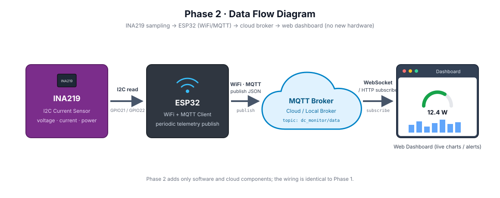
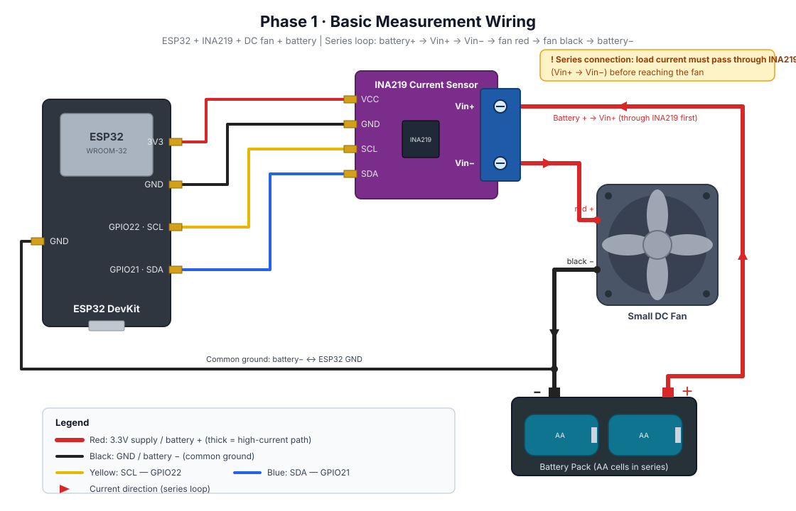
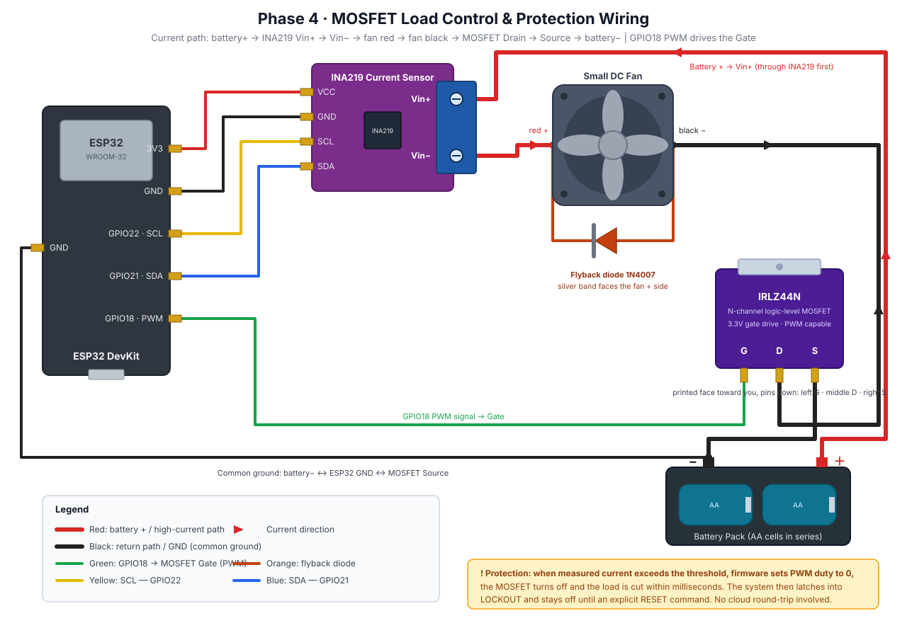
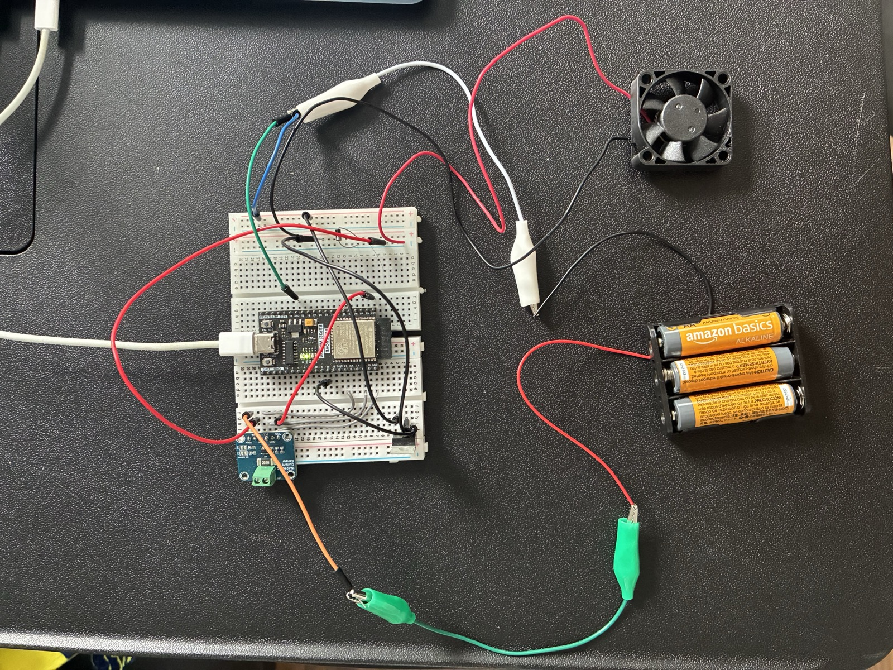

# DC Power Monitor

An ESP32-based IoT system for real-time DC power monitoring, remote load control, 
overload protection, and automated load characterization.

**Live Dashboard:** [self-project-frontend.vercel.app](https://self-project-frontend.vercel.app)

## System Architecture



## Wiring

### Phase 1 — Measurement only


### Phase 4 — With MOSFET control and protection


### The actual build


## Overview

This project measures voltage, current, power, and accumulated energy from a DC load 
using an INA219 sensor, streams the data to a public MQTT broker, and displays it on a 
web dashboard that also allows remote control of the load.

Unlike typical energy meter projects that operate on mains AC voltage, this system 
was intentionally designed around **safe low-voltage DC**, with a modern decoupled 
architecture (device → MQTT broker → web client) instead of an on-device web server.

## Features

- **Real-time measurement** — voltage, current, power, and accumulated energy (Wh via time integration)
- **Cloud telemetry** — ESP32 publishes JSON over MQTT to a public broker
- **Web dashboard** — Next.js + TypeScript app subscribes over WebSocket, updates live
- **Remote control** — dashboard buttons send commands back to the device (bidirectional MQTT)
- **PWM speed control** — MOSFET-driven load with adjustable duty cycle
- **Local overload protection** — current threshold triggers automatic cutoff in firmware (millisecond response, no cloud round-trip)
- **Latching lockout** — after a fault, system stays off until an explicit RESET command
- **Finite state machine** — OFF / ON / OVERLOAD / LOCKOUT / TEST_MODE
- **Automated power sweep** — steps PWM duty across its range, records power at each level, and plots the load's characteristic curve

## System Architecture


**Topics**
| Topic | Direction | Payload |
|---|---|---|
| `dc_monitor/data` | device → dashboard | telemetry JSON, 1 Hz |
| `dc_monitor/cmd` | dashboard → device | `on` / `off` / `reset` / `test` |
| `dc_monitor/sweep` | device → dashboard | per-step sweep data |

## Hardware

| Component | Purpose |
|---|---|
| ESP32 (Freenove WROOM) | Controller, WiFi, PWM |
| INA219 | High-side current/voltage/power sensing (I2C, 0x40) |
| IRLZ44N MOSFET | Logic-level switch for PWM load control |
| 1N4007 diode | Flyback protection for inductive (motor) load |
| DC fan + AA battery pack | Test load |

### Wiring

**Logic side**
INA219 VCC → 3V3 MOSFET Gate → GPIO18 (PWM)
INA219 GND → GND
INA219 SDA → GPIO21
INA219 SCL → GPIO22

**Power side** (current path)
battery(+) → INA219 Vin+ → Vin− → fan(+) → fan(−) → MOSFET Drain → Source → battery(−)
battery(−) → ESP32 GND (common ground — required)
Flyback diode across the fan, cathode (silver band) to fan(+)


## Protection Design

Protection runs **entirely in firmware on the ESP32**, not in the cloud. If the network 
drops, the device still protects itself.

```cpp
case ON:
    if (current_mA > currentThreshold) {
        currentState = OVERLOAD;   // trip
    }

case OVERLOAD:
    ledcWrite(fanChannel, 0);      // cut the load
    currentState = LOCKOUT;        // latch

case LOCKOUT:
    ledcWrite(fanChannel, 0);      // stays off — only RESET clears it
```

The lockout is deliberately **not** cleared by current returning to normal — cutting the 
load always drops current to zero, so "current is low" can never be a valid restart signal.
Only an explicit external RESET command clears the fault.

## Repository Structure
├── src/main.cpp ESP32 firmware
├── platformio.ini PlatformIO config
└── frontend/ Next.js dashboard
├── src/
└── package.json

## Getting Started

### Firmware
1. Open the project root in VS Code with the PlatformIO extension
2. Set your WiFi credentials in `src/main.cpp`:
```cpp
   const char* ssid = "YOUR_WIFI_NAME";
   const char* password = "YOUR_WIFI_PASSWORD";
```
3. Build and upload; open Serial Monitor at 115200 baud

### Dashboard
```bash
cd frontend
npm install
npm run dev
```
Open http://localhost:3000

## Notes

- The public broker (`broker.emqx.io`) has no privacy — anyone can subscribe to these 
  topics. Fine for a demo; use an authenticated broker for anything real.
- The device connects on port **1883 (TCP)**; the browser must use port **8084 (WebSocket)**.

## Tech Stack

**Firmware:** C++ (Arduino framework), PlatformIO, Adafruit_INA219, PubSubClient  
**Frontend:** Next.js, TypeScript, TailwindCSS, mqtt.js, Chart.js  
**Infrastructure:** MQTT (EMQX public broker), Vercel
- The public broker (`broker.emqx.io`) has no privacy — anyone can subscribe to these 
  topics. Fine for a demo; use an authenticated broker for anything real.
- The device connects on port **1883 (TCP)**; the browser must use port **8084 (WebSocket)**.

## Tech Stack

**Firmware:** C++ (Arduino framework), PlatformIO, Adafruit_INA219, PubSubClient  
**Frontend:** Next.js, TypeScript, TailwindCSS, mqtt.js, Chart.js  
**Infrastructure:** MQTT (EMQX public broker), Vercel
